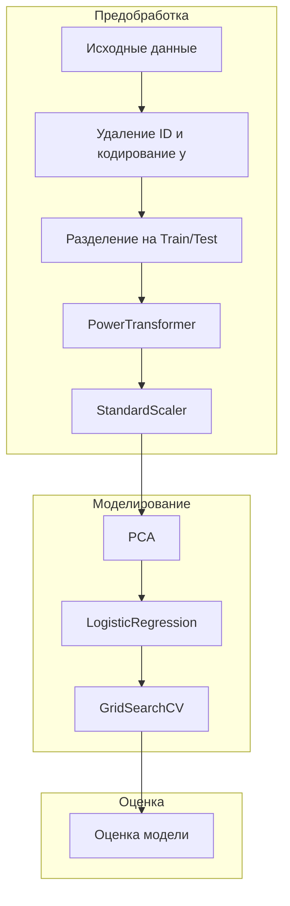

# Автоматизация и оркестрация пайплайна машинного обучения с использованием Apache Airflow и облачного хранилища.

## Содержание
[EDA](README.md#EDA)  
[Планирование пайплайна](README.md#Планирование-пайплайна)  
[Разработка ETL-компонентов](README.md#Разработка-ETL-компонентов)  
[Оркестрация пайплайна с помощью Airflow](README.md#Оркестрация-пайплайна-с-помощью-Airflow)  
[Анализ ошибок и устойчивости](README.md#Анализ-ошибок-и-устойчивости)    
[Результаты](README.md#Результаты)    
[Идеи по улучшению](README.md#Идеи-по-улучшению)    


## Цель проекта:
Создания пайплайна сбора, обработки и внедрения ML-модели для определения злокачественных опухолей.

## Структура проекта (основная):

```
etl_exam/
├── etl/
│   ├── extractor.py       # Загрузка данных
│   ├── transformer.py     # Очистка и предобработка
│   ├── trainer.py         # Обучение модели
│   ├── evaluator.py       # Расчёт метрик
│   └── saver.py           # Сохранение результатов
├── etl_exam/              # Виртуальное окружение
│   └── ...
├── config/
│   └── config.yaml        # Конфигурационный файл
├── logs/
│   └── etl_pipeline.log   # Логи
├── results/
│   └── eda/
│       └── firs_look.ipynb   # первичное исследование
│   └── raw/
│       └── wdbc.data      # сырые данные
│   └── models/
│       └── logistic_regression.pkl      # лучшая модель по сетке параметров
│   └── metrics/
│       └── metrics.json      # метрики в формате json
│   └── train_test/
│       └── X_test.csv     # Валидационная выборка
│       └── X_train.csv    # Тренировочная выборка
│       └── y_test.csv     # Валидационный таргет
│       └── y_train.csv    # Тренировочный таргет
├── dags/
│   └── pipeline_dag.py/            # DAG-airflow
├── container/
│   └── ...                # Контейнерная реализация проекта (финальный результат)
├── README.md              # Описание проекта
└── requirements.txt       # Зависимости
```


---

## Алгоритм выполнения задания

### EDA

Для формирования пайплайна, требуется провести разведочный анализ даннх и выявить ключевые этапы обработки,
что было произведено в [Исследовании](https://github.com/hotdonkey/etl_exam/blob/main/results/eda/first_look.ipynb).

Были выявленны особенности данных, такие как необходимость использования PowerTransform (отдадим на откуп автоматическому
преобразованию) ввиду ухода некоторых распределений к логнормальным и экспоненциальным.


А так же необходимость стандартизации и понижения размерности (из-за наличия мультиколлинеарности).


Наличия пропусков или дубликатов выявленно не было, все данные, кроме таргета, приведены к типу `float`.

:arrow_up:[К содержанию](README.md#Содержание)

---

### Планирование пайплайна

#### Описание задачи машинного обучения

Задача: **бинарная классификация** - предсказание типа опухоли молочной железы на основе медицинских признаков.

- Целевая переменная: `diagnosis` (значения `'B'` - доброкачественная, `'M'` - злокачественная)
- Метрика качества: **Accuracy**, дополнительные метрики: Precision, Recall, F1-score
- Подходящая модель: Логистическая регрессия
- Датасет: [Breast Cancer Wisconsin (Diagnostic)](https://archive.ics.uci.edu/ml/datasets/Breast+Cancer+Wisconsin+(Diagnostic))

---

#### Структура пайплайна

##### Последовательность этапов:

1. **Предобработка данных**
   - Удаление ID
   - Кодирование целевой переменной (`LabelEncoder`)
   - Разделение на обучающую и тестовую выборки

2. **Преобразование признаков**
   - Применение `PowerTransformer(method='yeo-johnson')` для нормализации распределений
   - Стандартизация признаков через `StandardScaler`

3. **Снижение размерности**
   - Метод главных компонент (`PCA`) - сохраняет 95% дисперсии

4. **Обучение модели**
   - Логистическая регрессия с подбором гиперпараметров:
     - `C` - коэффициент регуляризации
     - `penalty` - тип регуляризации (L1/L2/ElasticNet)
     - `fit_intercept` - использовать ли свободный член

5. **Оптимизация**
   - Поиск лучших параметров через `GridSearchCV`
   - Использование кросс-валидации (5 фолдов)

6. **Оценка качества**
   - Accuracy
   - Classification Report

---

### Схема пайплайна 



:arrow_up:[К содержанию](README.md#Содержание)

---

### Разработка ETL-компонентов


### Назначение скриптов

| Файл | Назначение |
|------|------------|
| `extractor.py` | Загружает исходные данные с сайта UCI и сохраняет их локально |
| `transformer.py` | Выполняет очистку и предобработку данных (удаление лишних колонок, кодирование целевой переменной, разделение на train/test) |
| `trainer.py` | Создаёт и обучает модель с помощью `GridSearchCV`, подбирая гиперпараметры |
| `evaluator.py` | Вычисляет и сохраняет основные метрики качества модели: Accuracy, Precision, Recall, F1-score |
| `logger.py` | Сохраняет логи |

---

### Связь между этапами

```
[extractor.py] --> [transformer.py] --> [trainer.py] --> [evaluator.py] --> logger.py
```

:arrow_up:[К содержанию](README.md#Содержание)

---

### Оркестрация пайплайна с помощью Airflow 

Оркестрация пайплайна осуществляется с использованием Airflow путем запуска `DAG-airflow : pipeline_dag.py` из контейнера

Описание зависимостей между задачами:

```python
extractor_task >> transformer_task >> trainer_task >> evaluator_task
```


1. `download_data_task` должна успешно завершиться перед запуском `preprocess_data_task`
 > Без загруженных данных невозможно провести предобработку.
2. `preprocess_data_task` должна успешно завершиться перед запуском `train_model_task`
 > Обучение модели требует предварительно обработанных данных.
3. `train_model_task` должна успешно завершиться перед запуском `evaluate_model_task`


Сборка, запуск и остановка:
```bash
docker compose build --no-cache airflow-init    
docker compose up airflow-init
docker compose up -d
docker compose down
```

Местонахождения:
`localhost:8081`

Примечание: Я использовал порт 8081 на localhost, т.к. 8080 был занят, но 8080 является стандартным портом airflow в контейнере, что привело к ассиметричному пробросу портов внутри compose файла.

Пример dag'a:


Пример успешного выполнения задач:


Данные сохраняются локально в папку results/ по нижеследующей логике:
- Сырые данные с источника сохраня.ься в raw/ для возможности использования сторонними сервисами (этап Extract)
- Преобразованные данные для моделирования сохраняютсяв train_test/ (этап Transform)
- Готовая модель сохраняется для использования в проде в model (этап Load)
- Полученные метрики сохранябтся в /metrics для использования в дашбордах (этап Load)

Каждая таска логируется в logs

## Структура контейнера:

```
container/
├── etl/
│   ├── extractor.py       # Загрузка данных
│   ├── transformer.py     # Очистка и предобработка
│   ├── trainer.py         # Обучение модели
│   ├── evaluator.py       # Расчёт метрик
│   └── saver.py           # Сохранение результатов
├── config/
│   └── config.yaml        # Конфигурационный файл
├── logs/
│   └── etl_pipeline.log   # Логи
├── models/
│   └── ...                # Папка из структуры compose файла из гайда Apache Airflow
├── plugins/
│   └── ...                # Папка из структуры compose файла из гайда Apache Airflow
├── results/
│   └── eda/
│       └── firs_look.ipynb   # первичное исследование
│   └── raw/
│       └── wdbc.data      # сырые данные
│   └── models/
│       └── logistic_regression.pkl      # лучшая модель по сетке параметров
│   └── metrics/
│       └── metrics.json      # метрики в формате json
│   └── train_test/
│       └── X_test.csv     # Валидационная выборка
│       └── X_train.csv    # Тренировочная выборка
│       └── y_test.csv     # Валидационный таргет
│       └── y_train.csv    # Тренировочный таргет
├── dags/
│   └── pipeline_dag.py/            # DAG-airflow
├── container/
│   └── ...                # Контейнерная реализация проекта (финальный результат)
├── README.md              # Описание проекта
├── .env                   # Переменные среды для compose файла
├── docker-compose.yml     # Compose файл устанавливающий зависимости
├── Dockerfile             # Небольшая кастомизация внесенная в compose файл
└── requirements.txt       # Зависимости
```

:arrow_up:[К содержанию](README.md#Содержание)

---

### Анализ ошибок и устойчивости

#### Потенциальные точки сбоя и механизмы обработки

1. **Загрузка данных (extractor.py)**
   - **Точка сбоя**: Обращение к внешнему источнику данных
   - **Возможные исключения**:
     - `requests.exceptions.ConnectionError` (потеря соединения)
     - `requests.exceptions.Timeout` (таймаут запроса)
     - `requests.exceptions.HTTPError` (ошибки HTTP 4xx/5xx)
   - **Устойчивость**:
     - Реализовано логирование ошибок с детализацией
     - Использование Airflow retries (3 попытки с интервалом 5 минут)
     - Таймаут соединения 30 секунд в параметрах DAG
     - Пример обработки:
       ```python
       try:
           response = requests.get(url)
       except Exception as e:
           logger.error(f"Ошибка загрузки: {e}")
           raise
       ```

2. **Преобразование данных (transformer.py)**
   - **Точка сбоя**: Чтение/обработка сырых данных
   - **Возможные исключения**:
     - `FileNotFoundError` (файл не скачан)
     - `KeyError` (отсутствие ожидаемых колонок)
     - `ValueError` (некорректные значения)
   - **Устойчивость**:
     - Проверка существования файла перед обработкой
     - Валидация структуры данных (наличие обязательных колонок)
     - Логирование размера и структуры данных
     - Изолированное сохранение сырых данных (не перезаписываются при ошибках)

3. **Обучение модели (trainer.py)**
   - **Точка сбоя**: Процесс обучения и оптимизации
   - **Возможные исключения**:
     - `ValueError` (несовместимость данных с моделью)
     - `ConvergenceWarning` (модель не сошлась)
     - `MemoryError` (недостаток ресурсов)
   - **Устойчивость**:
     - Отлов предупреждений через `warnings.catch_warnings()`
     - Сохранение модели только при успешном обучении
     - Логирование параметров и качества модели
     - Использование Airflow timeout (ограничение 60 минут)

4. **Оценка модели (evaluator.py)**
   - **Точка сбоя**: Загрузка артефактов и расчет метрик
   - **Возможные исключения**:
     - `FileNotFoundError` (отсутствие модели или данных)
     - `ValueError` (несовпадение размеров данных)
     - `KeyError` (отсутствие ожидаемых метрик)
   - **Устойчивость**:
     - Проверка существования файлов перед загрузкой
     - Обработка различных форматов ошибок предсказания
     - Изолированное сохранение метрик (не влияет на модель)

#### Общие механизмы обеспечения устойчивости

1. **Логирование**
   - Централизованный логгер во всех модулях (`setup_logger`)
   - Детальное логирование каждого этапа выполнения
   - Сохранение логов в отдельный файл (`logs/etl_pipeline.log`)
   - Пример:
     ```python
     logger.info("Загрузка данных...")
     logger.error("Ошибка валидации", exc_info=True)
     ```

2. **Airflow средства контроля**
   - Политики повторного выполнения:
     ```python
     default_args = {
         'retries': 3,
         'retry_delay': timedelta(minutes=5),
         'execution_timeout': timedelta(minutes=30),
     }
     ```
   - Callback-функции для оповещений об ошибках
   - Зависимости между задачами:
     ```python
     extractor_task >> transformer_task >> trainer_task >> evaluator_task
     ```

3. **Изоляция компонентов**
   - Модульная архитектура (ETL разделен на независимые этапы)
   - Раздельное хранение артефактов:
     - Сырые данные: `results/raw/`
     - Обработанные данные: `results/train_test/`
     - Модели: `results/models/`
     - Метрики: `results/metrics/`
   - Независимость этапов (сбой в трансформации не портит сырые данные)

4. **Валидация данных**
   - Проверка структуры данных после загрузки
   - Контроль размерности выборок
   - Верификация форматов файлов перед использованием
   - Пример:
     ```python
     if not os.path.exists(file_path):
         logger.error(f"Файл {file_path} не существует")
         raise FileNotFoundError
     ```

#### Сценарии восстановления

| Сценарий                     | Поведение системы                          | Механизм обработки                     |
|------------------------------|--------------------------------------------|----------------------------------------|
| Потеря соединения с источником | Повторные попытки подключения (3 раза)     | Airflow retries                        |
| Невалидные данные источника  | Прерывание трансформации, сохранение логов | Валидация структуры в transformer.py   |
| Ошибка обучения модели       | Пропуск этапов оценки, алерт               | Зависимости задач в DAG                |
| Отсутствие артефактов        | Немедленное прерывание потока              | Проверки существования файлов          |
| Ресурсные ошибки (OOM)       | Автоматический перезапуск задачи           | Airflow worker resurrection             |

Проект демонстрирует высокую устойчивость за счет:
- Изолированности компонентов
- Детального мониторинга через логирование
- Автоматических механизмов восстановления
- Четкого разделения данных между этапами
- Защитных проверок на каждом этапе выполнения

:arrow_up:[К содержанию](README.md#Содержание)

---

### Результаты

В результате выполненной работы мы имеем рабочий и воспроизводимый пайплайн по извлечению, обработке, моделированию и сохранению результатов.

### Идеи по улучшению


#### 1. **Мониторинг и алертинг**
- **Реализация системы оповещений**:
  - Интеграция с Slack/Telegram для уведомлений о сбоях через Airflow callbacks
  - Отправка метрик качества модели при значительном ухудшении показателей
- **Визуализация пайплайна**:
  - Дашборд Grafana для отслеживания времени выполнения задач, качества данных и метрик моделей
  - Интеграция с Prometheus для сбора метрик выполнения

#### 2. **Тестирование и валидация**
- **Unit-тесты**:
  - Покрытие критических компонентов (трансформации, обучения) тестами с pytest
  - Тесты на обработку краевых случаев (пустые данные, некорректные значения)
- **Интеграционные тесты**:
  - Сквозное тестирование пайплайна на синтетических данных
  - Валидация схемы данных с помощью Pandera или Great Expectations
- **Тестирование модели**:
  - Контроль дрейфа данных (data drift) и концептуального дрейфа (concept drift)
  - A/B тестирование новых версий моделей

#### 3. **Масштабируемость**
- **Обработка больших данных**:
  - Интеграция Spark/Dask для распределенной обработки
  - Перенос вычислений в облако (AWS S3, Google Cloud Storage)
- **Оптимизация ресурсов**:
  - Настройка параметров memory_limit для задач в Airflow
  - Пакетная обработка данных (chunk processing) для больших наборов

#### 4. **Улучшение ML-пайплайна**
- **Автоматическое логирование экспериментов**:
  - Интеграция MLflow/Weights & Biases
  - Сравнение различных моделей и гиперпараметров
- **Улучшение feature engineering**:
  - Автоматическая генерация признаков (feature tools)
  - Отбор признаков на основе важности
- **Автоматическое переобучение**:
  - Планируемый ретрайнинг по расписанию
  - Триггеры переобучения при падении качества

#### 5. **Безопасность и надежность**
- **Резервное копирование**:
  - Автоматическое сохранение контрольных точек (checkpoints)
  - Версионирование данных и моделей (DVC)
- **Обработка чувствительных данных**:
  - Шифрование PII-данных
  - Анонимизация медицинских показателей
- **Disaster recovery**:
  - Реализация сценариев восстановления после сбоев
  - Дублирование критических компонентов

#### 6. **Развертывание и CI/CD**
- **Контейнеризация**:
  - Создание отдельных Docker-образов для разных этапов
  - Оптимизация размеров образов
- **Автоматизация развертывания**:
  - CI/CD пайплайн с GitHub Actions/GitLab CI
  - Автоматическое тестирование и деплой при обновлении кода
- **Оркестрация**:
  - Миграция на Kubernetes (Airflow K8s Executor)
  - Использование сервисов типа AWS SageMaker Pipelines

#### 7. **Пользовательские интерфейсы**
- **API для предсказаний**:
  - FastAPI-интерфейс для обслуживания модели
  - Swagger-документация эндпоинтов
- **Дашборд аналитики**:
  - Streamlit/Panel-приложение для визуализации результатов
  - Мониторинг качества данных и моделей в реальном времени

#### 8. **Оптимизация процессов**
- **Кэширование промежуточных результатов**:
  - Использование Redis для хранения препроцессированных данных
  - Memcached для кэширования предсказаний
- **Параллельное выполнение**:
  - Запуск независимых задач конкурентно (Airflow CeleryExecutor)
  - Разделение данных на чанки для параллельной обработки

#### 9. **Документация и знания**
- **Автодокументирование**:
  - Генерация документации Sphinx из docstrings
  - Диаграммы последовательности для пайплайна (mermaid.js)
- **Knowledge sharing**:
  - Репозиторий моделей и фичей
  - Примеры использования в Jupyter Notebooks

#### 10. **Расширение функционала**
- **Поддержка нескольких источников**:
  - Добавление обработки SQL-баз, Kafka, S3
  - Унифицированный интерфейс для разных типов данных
- **Мультимодельные эксперименты**:
  - Одновременное обучение ансамблей моделей
  - Автоматический подбор лучшей модели (AutoML)
- **ML Ops практики**:
  - Мониторинг дрейфа данных в проде
  - Система автоматического rollback моделей

### Приоритетные направления
1. **Тестирование и валидация** - критично для медицинских данных
2. **Мониторинг и алертинг** - оперативное реагирование на сбои
3. **CI/CD автоматизация** - ускорение итераций разработки
4. **Документирование** - облегчение онбординга новых участников
5. **Безопасность данных** - соответствие требованиям GDPR/HIPAA

