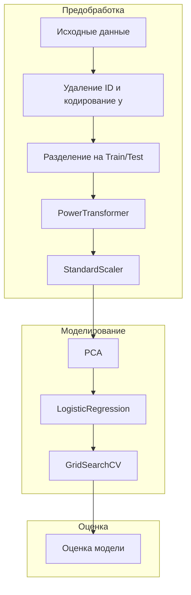

# Автоматизация и оркестрация пайплайна машинного обучения с использованием Apache Airflow и облачного хранилища.

---

## Алгоритм выполнения задания

### Этап 0. EDA

Для формирования пайплайна, требуется провести разведочный анализ даннх и выявить ключевые этапы обработки,
что было произведено в [Исследовании](https://github.com/hotdonkey/etl_exam/blob/main/etl/first_look.ipynb).

Были выявленны особенности данных, такие как необходимость использования PowerTransform (отдадим на откуп автоматическому
преобразованию) ввиду ухода некоторых распределений к логнормальным и экспоненциальным.

А так же необходимость стандартизации и понижения размерности (из-за наличия мультиколлинеарности).

Наличия пропусков или дубликатов выявленно не было, все данные, кроме таргета, приведены к типу `float`.

---

### Этап 1. Планирование пайплайна

#### Описание задачи машинного обучения

Задача: **бинарная классификация** - предсказание типа опухоли молочной железы на основе медицинских признаков.

- Целевая переменная: `diagnosis` (значения `'B'` - доброкачественная, `'M'` - злокачественная)
- Метрика качества: **Accuracy**, дополнительные метрики: Precision, Recall, F1-score
- Подходящая модель: Логистическая регрессия
- Датасет: [Breast Cancer Wisconsin (Diagnostic)](https://archive.ics.uci.edu/ml/datasets/Breast+Cancer+Wisconsin+(Diagnostic))

---

#### Структура пайплайна

##### Последовательность этапов:

1. **Предобработка данных**
   - Удаление ID
   - Кодирование целевой переменной (`LabelEncoder`)
   - Разделение на обучающую и тестовую выборки

2. **Преобразование признаков**
   - Применение `PowerTransformer(method='yeo-johnson')` для нормализации распределений
   - Стандартизация признаков через `StandardScaler`

3. **Снижение размерности**
   - Метод главных компонент (`PCA`) - сохраняет 95% дисперсии

4. **Обучение модели**
   - Логистическая регрессия с подбором гиперпараметров:
     - `C` - коэффициент регуляризации
     - `penalty` - тип регуляризации (L1/L2/ElasticNet)
     - `fit_intercept` - использовать ли свободный член

5. **Оптимизация**
   - Поиск лучших параметров через `GridSearchCV`
   - Использование кросс-валидации (5 фолдов)

6. **Оценка качества**
   - Accuracy
   - Classification Report

---

### Схема пайплайна 

